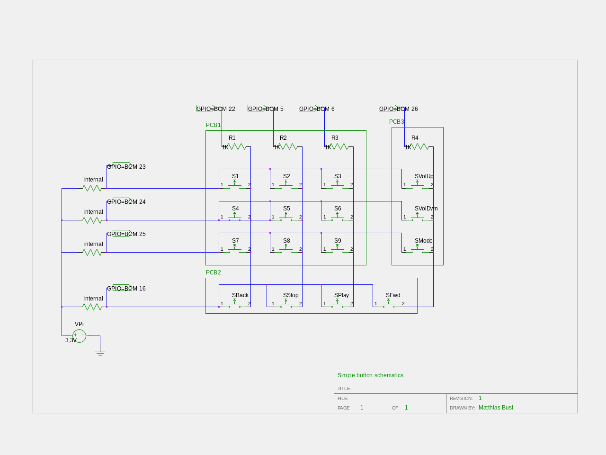

simpl - A Simple Music Player
===============

The goal of this project is to create a simple to use (mp3) music player for children.
On the hardware side a Raspberry Pi will be used, but any other should work as well (GPIO Pins assumed). 
The design is inspired by ["Hoerbert"](https://de.hoerbert.com/), however it will have more features (but need more power). 

## Software requirements

### Raspian packages (OS requirements)

- Music playback: [mpd](https://www.musicpd.org/) (`mpd`)
- Speech synthesis: [Google Android TTS engine (svox-pico-tts)](https://elinux.org/RPi_Text_to_Speech_(Speech_Synthesis)) (`libttspico-utils`)
- Speech-playback: [aplay](https://www.alsa-project.org/main/index.php/Main_Page) (`alsa-utils`)

TODO: Add configuration

### Python packages

- Raspberry Pi GPIO Access: [RPi.GPIO](https://sourceforge.net/projects/raspberry-gpio-python/)
- MPD-Control: [python-mpd2](https://github.com/Mic92/python-mpd2) 

## Configuratiom

### MPD

Dmix allows mixing of speech synthesis messages and music.

The software mixer allows volume control via MPD interface.

```
audio_output {
        type            "alsa"
        name            "dmixer"
#        options         "dev=dmixer"
#        device          "plug:dmix"
#        format          "44100:16:2"
#        options         "dev=dmixer"
#        device          "dev=dmixer"
        mixer_type      "software"
#        mixer_device    "default"    # optional
#        mixer_control    "PCM"        # optional
}
```
##Hardware setup
### GPIO configuration

Broadcom (BCM) numbering is used throughout this part (see https://pinout.xyz/)!
A button matrix is used to connect all required buttons to the Pi. 
For more information see [this blog post on embedded-lab.com](http://embedded-lab.com/blog/lab-18-matrix-keypad-interfacing/)

TODO: Add LED pin

```
J8:
   3V3  (1) (2)  5V    
 GPIO2  (3) (4)  5V    
 GPIO3  (5) (6)  GND   
 GPIO4  (7) (8)  GPIO14
   GND  (9) (10) GPIO15
GPIO17 (11) (12) GPIO18
GPIO27 (13) (14) GND   
GPIO22 (15) (16) GPIO23
   3V3 (17) (18) GPIO24
GPIO10 (19) (20) GND   
 GPIO9 (21) (22) GPIO25
GPIO11 (23) (24) GPIO8 
   GND (25) (26) GPIO7 
 GPIO0 (27) (28) GPIO1 
 GPIO5 (29) (30) GND   
 GPIO6 (31) (32) GPIO12
GPIO13 (33) (34) GND   
GPIO19 (35) (36) GPIO16
GPIO26 (37) (38) GPIO20
   GND (39) (40) GPIO21
```

| GPIO | OUT/IN | Pull up/down | Usage |
|----|----|----|----|
| GPIO5 |  OUT |  - |  Button Matrix output 2 |
| GPIO6 |  OUT |  - |  Button Matrix output 3 |
| GPIO16 |  IN |  PULL UP |  Button Matrix input 4 |
| GPIO22 |  OUT |  - |  Button Matrix output 1 |
| GPIO23 |  IN |  PULL UP |  Button Matrix input 1 |
| GPIO24 |  IN |  PULL UP |  Button Matrix input 2 |
| GPIO25 |  IN |  PULL UP |  Button Matrix input 3 |
| GPIO26 |  OUT |  - |  Button Matrix output 4 |


#### Button matrix to pin numbers

(using Broadcom pin numbering convention)

| GPIO Pins IN > | 23 | 24 | 25 | 16 |
|----|----|----|----|----|
| **22** |  1 (Button 1)|  2 (Button 2) |  3 (Button 3) |  4 (Volume Up) |
| **5** |  5 (Button 4) |  6 (Button 5) |  7 (Button 6) |  8 (Volume down) |
| **6** |  9 (Button 7) | 10 (Button 8) | 11 (Button 9) | 12 (Mode) |
| **26** | 13 (Rewind) | 14 (Stop) | 15 (Play/Pause) | 16 (Forward) |
|**OUT^** |||||

### Schematics
